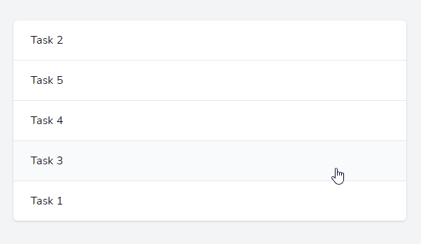

# Livewire SortableJS

A Livewire wrapper for [SortableJS](https://github.com/SortableJS/Sortable).

[](https://npmjs.com/package/livewire-sortablejs)
[](https://github.com/amiranagram/livewire-sortablejs/actions/workflows/build.yml?query=workflow%3Abuild+branch%3A0.x.x)
[](https://npmjs.com/package/livewire-sortablejs)
[](LICENSE.md)

---



A simple list of tasks in your component view.

```html
<div class="bg-white shadow overflow-hidden sm:rounded-md">
    <ul 
        wire:sortable="updateTaskOrder"
        wire:sortable.animation="150"
        class="divide-y divide-gray-200"
    >
        @foreach($tasks as $task)
            <li wire:sortable.item="{{ $task->id }}">
                <a href="#" class="block hover:bg-gray-50">
                    <div class="flex items-center px-4 py-4 sm:px-6">
                        Task {{ $task->id }}
                    </div>
                </a>
            </li>
        @endforeach
    </ul>
</div>
```

An update method in your component class.

```php
public $tasks;

public function mount()
{
    $this->tasks = Task::orderBy('order')->get();
}
    
public function updateTaskOrder($list)
{
    foreach($list as $item) {
        Task::where('id', $item['value'])
            ->update(['order' => $item['order']]);
    }
    
    $this->tasks = Task::orderBy('order')->get();
}
```

## Support me

<a href="https://www.buymeacoffee.com/amirami" target="_blank"></a>

I invest a lot of time writing quality software, what open-source market deserves.

Where I live I'm currently unable to apply for GitHub sponsorship. I was able to set up a Buy Me a Coffee account though. That's where you can show appreciation for my dedicated time to writing this package.

## Installation

### CDN

```html
<script src="https://cdn.jsdelivr.net/npm/livewire-sortablejs@0.x.x/dist/livewire-sortable.min.js" defer></script>
```

### NPM

```bash
npm install livewire-sortablejs
```

or

```bash
yarn add livewire-sortablejs
```

Then import the package into your bundle:

```js
import 'livewire-sortablejs'
// or
require('livewire-sortablejs')
```

## Usage

## Changelog

Please see [CHANGELOG](CHANGELOG.md) for more information on what has changed recently.

## Contributing

Please see [CONTRIBUTING](.github/CONTRIBUTING.md) for details.

## Security Vulnerabilities

Please review [our security policy](../../security/policy) on how to report security vulnerabilities.

## Credits

- [Amir Rami](https://github.com/amiranagram)
- [All Contributors](../../contributors)

## License

The MIT License (MIT). Please see [License File](LICENSE.md) for more information.
